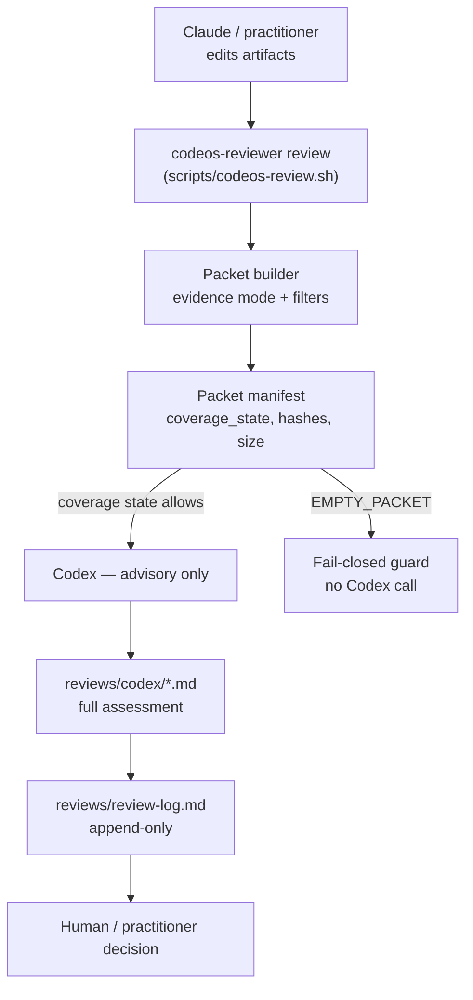
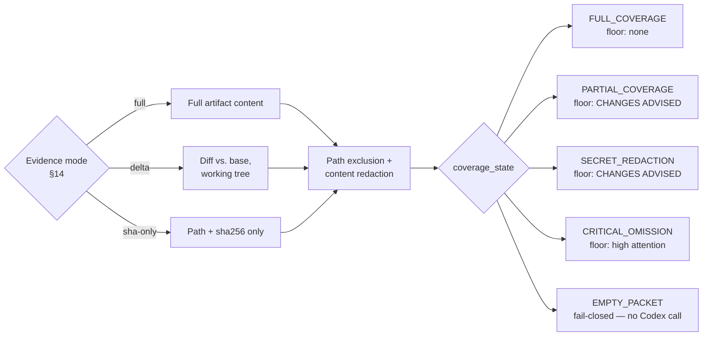
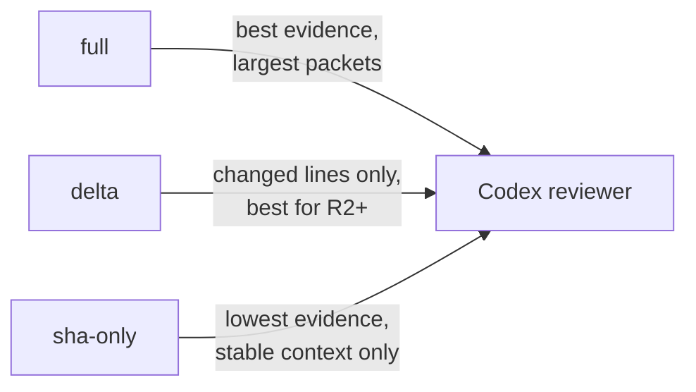

# Codeos Reviewer Pipeline — Manual Advisory Codex Reviewer

*A read-only, advisory, cross-model reviewer for DBA decisions. It compresses relevant
artifacts and evidence into a critical assessment and an append-only log entry so the human
decides faster—without the reviewer becoming a gate.*

> **v0 is a manual advisory review logging pilot.** It records review evidence and human
> decisions, but it does **not** enforce complete decision-integrity or rollback correctness.
> The persisted hashes, packet copy, and `workspace_dirty` flag are **audit aids**, not a formal
> guarantee that a workflow decision is bound to an unchanged repository state. The deeper binding
> model (decision bound to a reproducible reviewed state, decision-time reverification, rollback
> semantics) is **deferred** — see `Archive/self-development/backlog/completed/UPG-0015-reviewer-decision-integrity.md`.

> **The Bash implementation is a manual pilot wrapper.** It validates the workflow but is not the
> intended long-term review engine; the future typed engine is `Archive/self-development/backlog/completed/UPG-0018-reviewer-engine-v1.md`.

```yaml
status: PILOT — manual operation; no Claude Code hooks wired
scope: implements backlog/UPG-0003-reviewer-decision-brief.md, pulls in UPG-0006 (evidence grade)
binding: changes no Codeos doctrine rule; stage prompts remain authoritative
guarantees: advisory logging only — NOT approval-integrity or rollback (deferred to backlog)
```

---

## 0. Architecture at a Glance

**The core rule:** Codex produces advisory evidence. Invoking the reviewer does not give its
conclusions approval authority or create an approval gate that the governing workflow does not
already require.

The system separates into three layers:

1. **Governing workflow** — decides whether review is optional or required and who makes any
   resulting decision. Codeos self-development uses review only when useful; downstream DBA review
   follows the active downstream policy.
2. **Review engine** — builds the packet, applies an evidence mode, calls Codex, and records the
   result (§2, §4b, §14).
3. **Review records** — packet, assessment, and log output produced by the tool. Their existence is
   evidence, not authority.



Codeos self-development has no fixed review cadence. Downstream DBA projects follow the review
policy named by their active configuration.

## 1. Roles

- **Claude Code** follows the active DBA workflow in downstream projects and `CLAUDE.md` when
  developing Codeos itself.
- **Codex** is the independent reviewer, invoked **read-only** (`-s read-only`) by
  `scripts/codeos-review.sh`. Running a different model family gives cross-model adversarial
  review (less self-review circularity); running read-only means it *physically cannot edit
  artifacts* — it can only assess.
- **The human** decides. The reviewer recommends with non-gatekeeping vocabulary; `APPROVE`
  is reserved for the human.

This inherits the stance of `prompts/pipeline-reviewer.md` (the interactive Reviewer
Activation Package). This pipeline is the *automated* path; `prompts/reviewer-automated.md`
documents the prompt/packet convention.

## 2. The minimal prompt, the rich packet

The static reviewer task — five focused questions, what-not-to-do guidance, five-category
triage rule, and required output shape — is defined in `prompts/codeos-reviewer-task.md`
and injected at the top of every packet by `scripts/codeos-review.sh`. What makes the
review *DBA-specific* rather than generic is the **evidence packet** that follows: review
context (feature/stage/branch/base+review SHA), the DBA rules relevant to the stage, the
stage-specific checklist (sourced from `backlog/UPG-0003-reviewer-decision-brief.md`), the
expected stage output, the artifact contents with hashes, and the secret-filtered diff. See
`prompts/reviewer-automated.md` for the full packet shape.

Immediately after the reviewer task template and before `REVIEW CONTEXT`, every packet
includes a **`PACKET MANIFEST`** section listing each artifact with its inclusion mode
(`full_file`, `path_sha_only`, or `omitted_with_reason`), byte count, and sha256 (where
content is present), plus the diff size, `review_content_bytes` (full_file artifact bytes +
diff bytes), `estimated_review_tokens` (~`review_content_bytes / 4`), and `budget_status`.
If `review_content_bytes` exceeds `CODEOS_PACKET_BUDGET_BYTES` (default 50 000), a warning
is emitted to stderr and recorded in `budget_status`; the review is never aborted.

Pass `--sha-only PATH` (repeatable) to include a file in the manifest as `path_sha_only`
(path + sha256 + original byte count) without sending its content to the reviewer. Useful
for large unchanged reference files where the reviewer only needs to verify identity. If a
`--sha-only` path does not exist on disk, the script exits non-zero before any Codex
invocation — a missing guard file is an error, not a quietly omitted artifact.

## 3. Session continuity — feasibility

**Question:** can one Codex session be opened at the start and reused across every stage,
instead of a fresh session per stage?

**Answer: yes — via `codex exec resume <session_id>`, not a held-open process.** This was
verified against Codex 0.114: the first review for a feature runs `codex exec` and the
session id is captured from the Codex startup banner (`session id: <uuid>`); later reviews
run `codex exec resume <id>`, which rehydrates the full prior conversation (a resumed session
correctly recalled context across separate processes in testing) while each call is a
crash-safe fresh process. This is the "same continuous session" semantically, achieved
durably. (`codex mcp-server` is a future alternative; a held-open live process was rejected
as fragile.)

Invocation details that matter (0.114): `codex exec` takes `-s read-only` and `--cd`;
`codex exec resume` takes **neither** — sandbox is set via `-c sandbox_mode="read-only"` and
the working dir is the current dir. The script handles this difference.

**Sessions are feature-scoped** — `.codeos-state/codex-sessions/<feature>.json`. Continuity
is valuable *within* a feature and dangerous *across* features, so a different feature gets
its own session and `--fresh` forces a brand-new one (use it for safety-sensitive stages,
reviewer/human disagreement, or suspected anchoring on stale/pre-correction context).

**Memory is never truth.** Every review re-reads the artifacts and diff from disk pinned to
the review commit SHA, and records that SHA + per-artifact SHA256 + a diff hash. Session
memory aids cross-stage drift detection; the disk + hashes are authoritative. This is the
guardrail against the stale-context failure mode that DBA otherwise warns about.

Session-id capture is **deterministic / fail-closed**: the id is parsed from the bootstrap
call's own banner output, so it is exactly the session just created. If no id can be parsed,
the script aborts and logs nothing.

Sessions are also **version-pinned**: the session record stores the `codex --version` that
created it, and a resume across a changed Codex build is refused — the script starts a fresh
session instead of resuming under a different parser/behavior.

## 4. Evidence durability + append-only log

The exact on-disk shapes of every persisted artifact below — packet, assessment header,
session state, REVIEW entry, HUMAN DECISION entry — are specified as **v0 normative schemas**
in [`reviewer-artifact-schemas.md`](reviewer-artifact-schemas.md), including required fields,
allowed enum values, and the lightweight fail-closed validation the script applies. Full
JSON Schema validation is deferred until pilot use shows it is needed.

- The **full** Codex assessment is saved under `reviews/codex/<ts>-<feature>-stage-<N>-<sha>.md`,
  opening with a self-contained YAML metadata header (feature/stage/branch/base+review
  commit/artifacts+sha256/diff_hash/coverage_state/redaction_count/secret_redaction/
  excluded_paths/reviewed_packet+sha256/codex_concern/effective_concern/evidence) so the file
  is auditable on its own.
- The **exact bytes that were reviewed** are persisted as the canonical packet under
  `reviews/codex/packets/<ts>-<feature>-stage-<N>-<sha>.packet.txt`, with its own SHA256
  recorded in the assessment and the log. It contains the full context, artifact contents,
  filtered diff, and the exclusion/redaction list — so for uncommitted artifacts, since-edited
  files, and filtered diffs you can prove precisely what Codex saw, not merely a hash of it.
  Going forward (see §4a), stage reviews that are part of the official audit trail are
  committed with the feature branch; pilot/test runs use `reviews/codex/_scratch/` (gitignored).
  Pre-policy reviews were not committed — see §4a and the `reviews/review-log.md` header.
- `reviews/review-log.md` is **append-only**. The REVIEW entry records **both** the raw
  `Codex concern` and the `Effective concern` (after the coverage floor), the coverage state,
  redaction count, hashes, and links. The human decision is a **separately appended** entry
  via `codeos-review.sh decision …` — prior entries are never edited. As a **best-effort audit
  aid**, that command re-hashes the named reviewed artifacts and records MATCH / CHANGED per
  artifact; a `CHANGED` line is flagged (and a warning printed) but **never blocks** the
  decision. **The decision command records the human's choice; it does not enforce approval
  eligibility, refuse approvals, or bind approval to a reproducible reviewed state.** `APPROVE`
  records a human decision. Stronger guarantees — binding approval to a
  durable reviewed state (commit + diff hash + workspace snapshot), decision-time reverification,
  hard stops, and rollback semantics — are **deferred** and tracked in
  `Archive/self-development/backlog/completed/UPG-0015-reviewer-decision-integrity.md`.

## 4a. Review artifact durability policy

Not all review artifacts need to be committed. This policy (established by UPG-0029 /
CHG-20260629-001) defines which artifacts are **committed (durable)**, which are **scratch
(local-only)**, and what `reviews/review-log.md` references must satisfy.

**Committed / durable:** A review assessment or packet is *committed (durable)* when it is
cited in `reviews/review-log.md` by path+sha without a `[local-only]` marker, and the file
is committed to the repository. Such files are verifiable from a fresh checkout — another
reviewer can locate and read them. Place durable files under `reviews/codex/` (root) and
`reviews/codex/packets/`; commit them with the feature branch.

**Scratch / local-only:** Pilot runs, test reviews, and exploratory assessments that will
not be cited in the official log are kept local-only. Place them under
`reviews/codex/_scratch/` (gitignored); they are never committed.

**The rule for `review-log.md` references:** A log entry that references a full assessment
by path+sha must *either* point to a file that is committed to the repository, *or* the log
entry must explicitly mark the reference as `[local-only]` / non-durable. A reference that
does neither creates a fake audit trail — a checkout cannot verify it, and another reviewer
cannot read it.

See `reviews/review-log.md` header for the retroactive classification of pre-policy entries.

## 4b. Delta review mode (R2+)

CLI: `bash scripts/codeos-review.sh review <feature> <stage> <artifacts…> --mode delta --base <sha>`

When running R2 or later for the same step, send a **delta packet** rather than the full
context. A delta packet contains only:

1. The specific acceptance criterion or claim under challenge (verbatim from the change record)
2. Changed lines since the previous round — exact unified diff of affected files only; no
   surrounding unchanged context
3. One-line per-finding summary from the previous round: finding description,
   IN-SCOPE BLOCKER|NON-BLOCKER classification, and what was changed to resolve it
4. Current trace header state: `state`, `current_step`, `review_state` only

A delta packet must **NOT** include:
- Full backlog catalogs or feature briefs
- Full prior assessment prose
- Unchanged file contents
- Unrelated documents (roadmap, dba-system.md, downstream doctrine, etc.)
- The full change record if only one section changed

**Round trigger:** use delta mode for R2 and every subsequent round at the same step. R1 always
gets the full packet.

## 4c. Claim audit

Before every Codex call, scan all new or modified prose for **universal quantifiers**: "all",
"every", "never", "always", "no X", "any", "none". For each instance:

1. **Provide evidence** — confirm the claim is literally true; state how you would verify it.
2. **Weaken** — replace with "most", "typically", "in most cases", or a conditional if the
   claim is not universal.
3. **Remove** — if the claim adds no value or cannot be defended.

Universal claims without evidence are the most common source of Codex-flagged false claims
across UPG-0001 and UPG-0029. Running this audit before calling Codex prevents a class of
blockers that would otherwise cost a full review round.

## 4d. Future direction — not implemented

No `ReviewRun` record, event ledger, or control-plane component was found by a repo-wide
search of tracked files as of this change
(`grep -rn "ReviewRun\|control-plane\|event ledger" --include="*.md" .`). The only matches are
this paragraph itself (naming the terms in order to say they are absent) and this change's own
new backlog/change/review files (`Archive/self-development/backlog/completed/UPG-0044-*.md`, `Archive/self-development/changes/UPG-0044__*.md`,
`reviews/codex/*UPG-0044*.md`) — this section exists only to
say so explicitly, not to describe a planned design. The deferred, stronger-guarantee work that
such a component would
eventually need to satisfy is already tracked, narrowly, in
`Archive/self-development/backlog/completed/UPG-0015-reviewer-decision-integrity.md`: binding a workflow decision to a reproducible
reviewed state (commit + diff hash + workspace snapshot), decision-time reverification, and
rollback semantics. That backlog item is the authoritative pointer for this direction; treat
anything beyond it (a named `ReviewRun` schema, an event ledger, an automated control plane) as
unapproved and undesigned until a Step 1 change intent says otherwise.

## 4e. Structured findings

Each review round's `Finding:`/`Evidence:`/`Why:`/`Required action:` blocks (§7's TRIAGE RULE
output shape) are mechanically parsed (`UPG-0047`) into a `findings:` list in the **same**
assessment frontmatter `review_id` lives in — no new artifact, no new storage. Each entry gets a
deterministic `finding_id` (`FND__<review_id>__NN`) and carries only
`severity`/`classification`/`summary`/`acceptance_criterion`/`required_action`; the full
`Evidence:`/`Why:`/`Scope reason:` prose stays exactly where it already was, in the body, not
duplicated into YAML.

There is **no `status` or `resolved_by` field**. An assessment is an immutable, committed
snapshot of what the reviewer said at that moment — "resolved" is not a fact that exists yet
when the file is written, so storing it there would either be permanently wrong (`open`
forever) or require mutating an already-committed file, breaking the durability guarantee (§4a).
Resolution is instead answered by a query over durable records that already exist: a finding is
resolved when a **later, accepted** change record's `fixes_findings` trace-header field names
its `finding_id` — self-reported by whoever fixes it, at fix time, exactly matching current
practice. No lookup tool for this exists yet; building one is optional future work.

The parser accepts multiple real `Evidence:`/`Why:`/`Required action:` layouts — Codex does not
reliably combine them onto one line even though the prompt asks for that — and never silently
drops a `Finding:` line it cannot parse; `unparsed_findings_count` records the count instead,
advisory only, never blocking the review.

## 5. Coverage and effective concern

Defined normatively in [`reviewer-artifact-schemas.md`](reviewer-artifact-schemas.md) (coverage
rules); this section is a walkthrough, not a second normative source. The five
`coverage_state` values, worst-to-best, are `EMPTY_PACKET` > `CRITICAL_OMISSION` >
`SECRET_REDACTION` > `PARTIAL_COVERAGE` > `FULL_COVERAGE`. `EMPTY_PACKET` is **fail-closed**:
the script exits before any Codex invocation (see §4b's untracked-artifact guard and
`Archive/self-development/backlog/completed/UPG-0031-review-delta-mode-fix.md`, which fixed delta mode comparing only to `HEAD`
— missing uncommitted fixes — by comparing the base commit to the working tree instead, and
added this fail-closed guard so an empty diff can never silently reach Codex as reviewable
content).



In summary: two filtering layers run before anything reaches Codex — **path exclusion**
(`.env*`, `*.pem`, `secrets/*`, size limit, …) applies to the **diff and incidental files only**,
and **content redaction** blanks secret-like values in place in both the diff and requested
artifacts. A requested artifact is therefore never silently dropped — it is `shown`,
`shown_redacted`, `oversize_omitted`, or `missing`. The resulting `coverage_state` fixes the
**minimum effective concern** (an evidence-coverage gap is a verdict floor, not a footnote). This
is about *how complete the evidence was*, not approval eligibility. When anything is
excluded/redacted, or on a critical/empty state, the log flags **MANUAL SECURITY REVIEW
REQUIRED**. `workspace_dirty` is recorded as descriptive audit context only.

**Full Context Diff (supplementary context only):** The Full Context Diff section
(appended in `--mode delta --base` runs) is supplementary and informational, not primary
evidence. Its redactions increment `redaction_count` in the assessment header, but they do
**not** change `coverage_state` and do not trigger the manual-security-review flag — because
`coverage_state` reflects named-artifact evidence completeness, not the supplementary diff.
A git error in the full-diff fetch is marked explicitly as `[ERROR: git diff failed — …]`
in the packet, so it is never silent.

## 6. Concern-level semantics + human responsibility

- **NO OBJECTION** — no material reason to stop found; *this is not approval*.
- **CHANGES ADVISED** — issues that should be addressed or consciously waived.
- **DO NOT ADVANCE** — a material DBA risk; the human should not approve without resolving or
  explicitly overriding.
- **UNCLASSIFIED** — malformed/insufficient reviewer output (no parseable `LOG SUMMARY`);
  treated as **HIGH attention / manual review required**, never neutral.

Evidence grade (optional, backlog #13): `EVIDENCE: A–E` — concern level is *what the reviewer
thinks*; evidence grade is *how well supported it is*. If absent, the log records
`Evidence: not reported`; #13 is not "done" until the reviewer reliably emits it.

> **The reviewer reduces human reading load; it does not reduce human responsibility.** A
> human may approve a stage against the reviewer, but must record the reason in the HUMAN
> DECISION entry when doing so. The reviewer is evidence compression, not decision transfer.

## 7. What a good review looks like (calibration)

This pipeline was itself shaped by several rounds of real Codex review of its own plan. The
qualities that made those reviews valuable are the bar the automated reviewer aims at:

- **Operational, not only philosophical** — it named concrete bugs (append-only violations,
  wrong state locations, brittle session capture), not just abstractions.
- **Ranked by severity** — required corrections separated from optional improvements.
- **Concrete better-designs** — every objection came with a specific proposed fix.
- **Honest about tradeoffs** — e.g. flagging when a "one cheap call" claim was really a
  mini-pilot.
- **Ends with a clear decision** — approve / approve-with-fixes / do-not-approve, per area.

The stage-specific checklists encode this intent; the packet's INSTRUCTIONS line asks for
exactly this shape.

## 8. DBA-philosophy scorecard

| Capability | DBA impact | Why |
|---|---|---|
| Cross-model Codex reviewer, read-only | **Positive** | Adversarial second model; cannot edit artifacts |
| Feature-scoped session via `exec resume` | **Neutral** | Re-reads artifacts + SHA-pins every review; `--fresh` escape hatch; no cross-feature bleed |
| Durable assessments + append-only log (no mutable fields) | **Aligned** | Mirrors `runtime_events.jsonl` + existing append-only Decision Log |
| Advisory concern field (non-gatekeeping words) | **Neutral** | `APPROVE` reserved for the human |
| Secret/diff filtering | **Positive** | Reduces common credential-leakage risk in the review packet (heuristic, not a guarantee) |
| Automated hooks | **Risky → kept inert** | Documented (Appendix), not wired |
| Autonomous approval | **Negative — violates human control** | Rejected/deferred (Appendix) |

## 9. Acceptance criteria (mini-design gate)

read-only reviewer edits no artifacts · review output durable (full assessment saved) ·
sessions feature-scoped · reviewed state pinned (base+review SHA, artifact hash) · malformed
output → UNCLASSIFIED/high-attention · secret/large-diff filtering present · no hooks active ·
no core rules changed.

## 10. Architecture: `codeos-review.sh` is a locator shim

```bash
# scripts/codeos-review.sh — resolves the reviewer binary and delegates every subcommand:
# exec "${BINARY}" "$@"
```

`codeos-review.sh` is a **locator shim** (see `UPG-0038` for why it isn't shorter: a
caller-git-repository precondition, plus script-relative binary-path resolution that works
correctly through the `.codeos` symlink from a downstream project, plus a PATH fallback if
the compiled binary isn't found at its expected location). Every subcommand is passed through
unchanged using `exec "${BINARY}" "$@"`.

**Consequence for upgrades:** any reviewer *capability* change — new packet sections, new
subcommand behavior, new flags, new decision-log fields, anything the Rust engine itself must
parse or act on — lives in the **Rust engine** (`tools/reviewer/src/`). The bash script changes
only for binary location, build instructions, or path-resolution semantics.

## 11. Usage

```bash
# record the base commit for a stage (so review diffs base->review, not just HEAD)
scripts/codeos-review.sh stage-start listing-ingestion 2

# review an artifact (resumes the feature's Codex session; --fresh starts a new one)
scripts/codeos-review.sh review listing-ingestion 2 contracts/listing-ingestion_contract.md

# after the human decides, append the decision (never edits prior log entries)
scripts/codeos-review.sh decision listing-ingestion 2 REQUEST_CHANGES "missing failure scenario"
```

**Local prechecks** run automatically before the packet is built and before any Codex
invocation. They scan only the positional artifact paths passed to `review`. Two hard-fail
checks exit non-zero immediately: (1) a literal unfilled template placeholder (`UPG-####` or
`CHG-YYYYMMDD-NNN`) in any artifact, and (2) a line-anchored `latest_review:` field (a
schema field superseded by UPG-0001). A warning is emitted to stderr (but Codex is still
invoked) for unresolved draft markers: `TODO`, `FIXME`, `TBD`, `[to be filled]`. Pass
`--guard-clean PATH` (repeatable) to assert that a specific file — e.g. `dba-system.md`
during a `self-dev only` change — has no uncommitted changes; a non-existent path or a dirty
path both exit non-zero before Codex. Pass `--skip-prechecks` to bypass all checks (emits a
visible `warning: prechecks skipped` to stderr); useful for inspecting draft artifacts with
`--print-packet`.

---

## 12. Downstream usage

A downstream project that ran `dba-init.sh` and loads `.codeos/dba-system.md` uses the same
`codeos-reviewer` binary and `review`/`decision`/`diagnose` subcommands. Use the Stage IDs and review
cadence defined by the project's active DBA configuration.

**Invoking the shim from a downstream project.** `.codeos/scripts/codeos-review.sh` resolves
its binary path from the script's own physical location (following the `.codeos` symlink
through to Codeos), so it works correctly from within a downstream project (fixed by
`UPG-0038`; previously it resolved via the *calling* project's git root instead, which broke
under a symlinked invocation). E.g. reviewing a Stage 2 contract:
```bash
.codeos/scripts/codeos-review.sh review checkout-flow 2 contracts/checkout-flow_contract.md
```
Reviewing a Feature Brief before confirming it:
```bash
.codeos/scripts/codeos-review.sh review checkout-flow brief backlog/checkout-flow.md
```
**`.codeos/scripts/codeos-review.sh` (or `scripts/codeos-review.sh` for Codeos's own
self-development) is the supported entry point**, not a convenience wrapper among several equally
valid options. Direct binary invocation
(`/path/to/Codeos/tools/reviewer/target/release/codeos-reviewer ...`, where `/path/to/Codeos` is
wherever `.codeos` resolves to — check with `readlink -f .codeos`) can still run, but it bypasses
the supported wrapper's repository precondition and binary-location behavior.

**If reviewer tooling isn't built or configured** for a downstream project, see
the `review_policy` component selected through `dba-system.md` → "Review Waiver" — record a plain reason in that feature's review
log and proceed; applicable workflow decisions remain owned by their doctrine adapters.

---

## 13. Verification round-trip

Every review round already ends with a `HIGHEST-IMPACT UNCERTAINTY:` line (mandated by
`prompts/codeos-reviewer-task.md`'s output format) — one sentence naming the single thing
that, if wrong, most affects the assessment. Separately, `prompts/verify-only.md` implements
a full read-only verification mode: a no-edit rule, before/after anti-blur `git status`/`git
diff --exit-code` checks proving the tree wasn't mutated, and a structured Verification-Only
Report.

When that uncertainty names something mechanically checkable — a specific file, command, or
repository state — the acting agent may run a `verify-only.md` pass targeting exactly that
uncertainty, then feed the resulting report back as evidence for the next review round. This
session used exactly this pattern more than once: UPG-0019's Step 3 rounds re-ran the review
with `check_drift.rs` (then `main.rs`) shown directly after the prior round's uncertainty
named an unverified claim about their behavior; UPG-0024's Step 2 rounds resolved two
internal-contradiction findings the same way — show more, re-review, resolve.

This is judgment, not automation: the acting agent decides whether an uncertainty is
checkable and whether running verification is worth the round-trip. It is never mandatory and
adds evidence without acquiring decision authority.

The `review_policy` component selected through `dba-system.md` carries the same practice, in the
same terms, for downstream DBA projects — the two are kept in sync deliberately, not maintained independently.

---

## 14. Evidence Modes

The reviewer supports three evidence modes to control packet size and review focus. These modes
affect only the evidence included in the packet; they do not create or alter workflow boundaries.

**At a glance:**

| Mode | Best use | Main risk |
|---|---|---|
| `full` | Round 1 of a review; small/primary artifacts | Packet bloat on large stable files |
| `delta` | Round 2+ after fixes | Wrong/stale `--base`; untracked artifacts error (§4b guardrail) |
| `sha-only` | Large unchanged context files, not the primary artifact | Reduced review evidence — reviewer cannot inspect content |



### Full Mode — default

Includes full artifact content where allowed by packet size and redaction rules.

**Use when:**
- Running Round 1 of a review
- Reviewing the primary artifact under active change
- The reviewer needs full context to assess the artifact

**Command:**
```bash
.codeos/scripts/codeos-review.sh review <feature> <stage> <artifact-paths>
```

### Delta Mode

Includes only changes since a base commit. Unchanged artifacts are represented by path and hash only.

**Use when:**
- Running Round 2 or later after fixing reviewer findings
- The packet exceeds the size budget and most artifacts are unchanged
- The review should focus on what changed since the previous round

**Command:**
```bash
.codeos/scripts/codeos-review.sh review <feature> <stage> --mode delta --base <commit-sha> <artifact-paths>
```

**Guardrail:** Delta mode requires artifact paths to be tracked by git. Untracked files cannot be compared to the base commit and will error.

### SHA-Only Mode

Includes only the file path and hash, not file content. **This reduces packet size but also reduces review evidence.**

**Use only for:**
- Large unchanged context files
- Files needed for packet completeness but not for substantive review
- Files that are not the primary artifact under review

**Command:**
```bash
.codeos/scripts/codeos-review.sh review <feature> <stage> --sha-only <context-file> <other-artifacts>
```

**Guardrail:** Do not use SHA-only for files whose changed behavior, wording, or structure the reviewer must assess. Changed behavior must remain reviewable as full content or diff.

### Combining Modes

Delta mode and SHA-only can be combined. When both apply, SHA-only paths are included as path/hash references rather than full content or diff.

```bash
scripts/codeos-review.sh review feature-x implementation \
  --mode delta --base abc123 \
  --sha-only docs/large-reference.md \
  CLAUDE.md tools/reviewer/src/packet.rs
```

### Preview a plan before reviewing

`codeos-review.sh plan` (like `review`, resolved through the wrapper — §12a) accepts the exact same arguments as `review` (feature, stage,
artifacts, `--mode`/`--base`, `--sha-only`) and reports what a `review` call with those
arguments would send — resolved artifacts with their mode and byte size, `review_content_bytes`
vs. the packet budget, `estimated_review_tokens`, coverage state, and (when over budget) the
same size/contributor/delta-suggestion warning `review` itself prints. `plan` calls the exact
same `packet::build()` function `review`/`--print-packet` use, so it cannot describe a packet
`review` wouldn't actually build.

```bash
scripts/codeos-review.sh plan feature-x implementation CLAUDE.md tools/reviewer/src/packet.rs
```

`plan` never resolves or invokes a provider and never writes to `reviews/` or any other tracked
file — it only builds and reports the packet plan. Unlike `--print-packet`, which prints the
full packet text Codex would receive, `plan` prints a compact summary; use `--print-packet` when
you need to inspect the packet's exact byte-for-byte content.

---

## Appendix A — Inert hook snippets (NOT part of the pilot)

These are provided for a *future* phase only. **Do not add them to `.claude/settings.json`
yet** — the pilot runs the script manually until the advisory reviewer has a proven track
record. A guarded `Stop` hook keyed on a sentinel avoids reviewing every stop.

The hook delegates to a small wrapper rather than an inline one-liner, because the cleanup
must be **success-gated** (do not consume the request if the review failed) and the artifact
paths must be **quoted/arrayed** (never word-split a `jq` expansion):

```jsonc
// .claude/settings.json — illustrative ONLY, not enabled
{
  "hooks": {
    "Stop": [
      { "command": "scripts/codeos-review-hook.sh" }   // no-op unless the sentinel exists
    ]
  }
}
```

```bash
# scripts/codeos-review-hook.sh — illustrative ONLY
#!/usr/bin/env bash
set -euo pipefail
req=".codeos-state/review-request.json"
[[ -f "${req}" ]] || exit 0                       # nothing requested → no-op
feature="$(jq -r '.feature' "${req}")"
stage="$(jq -r '.stage' "${req}")"
mapfile -t paths < <(jq -r '.artifacts[]' "${req}")   # array-safe, no word-splitting
# abort WITHOUT deleting the sentinel if the request is unparseable or names no artifacts
[[ -n "${feature}" && -n "${stage}" && ${#paths[@]} -gt 0 ]] || {
  echo "review-hook: malformed/empty request; sentinel preserved" >&2; exit 1; }
if scripts/codeos-review.sh review "${feature}" "${stage}" "${paths[@]}"; then
  rm -f "${req}"                                  # consume the sentinel ONLY on success
fi
```

## Appendix B — Rejected / Deferred — Not Approved for Implementation

**Autonomous workflow decisions.** A reviewer may provide evidence and recommendations, but it
never completes a doctrine adapter or other workflow boundary. Autonomous decisions are not built
toward by this pipeline.
